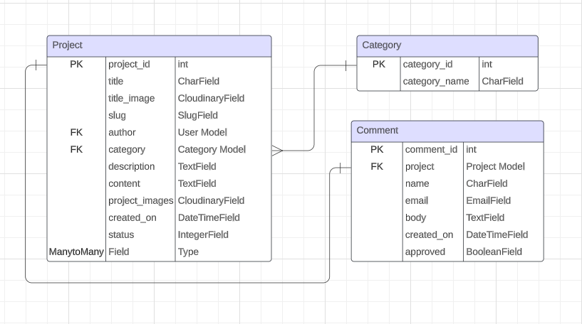

# Craft Masters

Welcome to Craft Masters, a vibrant online community where woodworking enthusiasts of all skill levels come together to celebrate the artistry of woodcraft. The Craft Masters blog is a dedicated space for passionate individuals to showcase their woodworking projects, share insights, and inspire fellow craftsmen. 

Whether you're a seasoned woodworker with years of experience or a newcomer eager to explore the world of woodworking, Craft Masters is your haven. Join in on this creative journey, where each project is a masterpiece and every craftsperson is a master in their own right. Let the sawdust fly and the creativity flourish – welcome to Craft Masters, where the beauty of woodworking knows no bounds.

The live project can be accessed [here]()


## Index – Table of Contents

* [UI/UX](#uiux)
* [Agile Development](#agile-development)
* [User Stories](#user-stories)
* [Database Structure](#database-structure)
* [Wireframes](#wireframes)
* [Features](#features)
* [Technologies Used](#technologies-used)
* [Testing](#testing)
* [Bug Fixes](#bug-fixes)
* [Known Bugs](#known-bugs)
* [Deployment](#deployment)
* [Credits](#credits)
* [Acknowledgements](#acknowledgements)

## UI/UX

### Design Overview
The main goal of the site is to allow users to upload their own opinions and projects to a blog site for other people with the same interests. Inspiring conversation and interaction about all things to do with wood working. The website was designed to be intuitive and easy to navigate providing feedback to the user in the form of on screen messages. Projects are promoted on almost every page of the site encouraging user to click and see more. Everything on the site should be easy to find and self-explanatory providing a good user experience.

### Colour Scheme
Initially, I didn't want the colour scheme to be too outlandish as I didn't want it to take away from the main content of the site, which are the project articles. For this reason, I decided to use quite mellow colours throughout the site. Generally I used a 'Seasalt' white for the site background and for any text elements on a darker background. An 'Eerie Black' Colour was used for the nav bar and footer to emphasise a harsh contrast between the site body and nav/footer. 

A 'Tomato' red/orange was used for the site buttons and links as I felt an orange colour worked well with the theme of wood, being a lighter variation of brown. Most text elements on the site are in a 'Jet' grey colour as I feel it complements well against the seasalt background and is easier on the eyes compared to plain white & black. I also ued a 'Kelly Green' colour for the 'NEW' label on the site home page.

[Coolors.co](https://coolors.co/) was used to generate the images of the colour palettes below.

#### Site Colour Pallet

<p align="center">
    
</p>

- `#252525` used for nav bar & footer.
- `#F26749` used for buttons & links.
- `#D12600` used for hover effects.
- `#155724` used for button text.
- `#D4EDDA` used for button background.
- `#C3E6CB` used for button border.

### Fonts & Icons

- The 'Poppins' font was used for all text on the site. 

This font was sourced from [Google Fonts](https://fonts.google.com/).

- Heart icon used for the like button.
- Comments icon was used for the comments.
- Envelope icon used for email contact info.
- Phone icon used for phone contact info.

Icons sourced from [Font Awesome](https://fontawesome.com/).

## Agile Development

This project was launched alongside a GitHub Projects Page in order to measure and manage the anticipated workload. The goal was to outline my projected workload, list the epics, and then break them down into user stories or bite-sized tasks to work on in order to complete the site on time.

To see the project Kanban please click [here](https://github.com/users/MarkD117/projects/6).

At the initial planning stages, I planned each page individually listing the requirements and features I wanted to include. From these page plans, I created the user stories. The user stories were implemented in such a way that the core functionality of the site works seamlessly. This was mainly centered around the projects being created and displaying correctly.

On each user story, acceptance criteria was added along with tasks. Once a task was completed, the appropriate box would be ticked and if all parts of the user story were completed and the acceptance criteria was met, the user story was moved from **In Progress** to **Completed**.

#### User stories

####  Completed User Stories

Click on a user story below to be directed to the Kanban project to examine any of the additional details of the user stories. If the specific story does not appear automatically, please click on it from the project page for more details.

 1. [USER STORY: Landing Page](https://github.com/MarkD117/craftmasters/issues/1)
 2. [USER STORY: View Projects Page](https://github.com/MarkD117/craftmasters/issues/2)
 3. [USER STORY: View Project Post Info](https://github.com/MarkD117/craftmasters/issues/3)
 4. [USER STORY: Site Pagination](https://github.com/MarkD117/craftmasters/issues/4)
 5. [USER STORY: Open a post](https://github.com/MarkD117/craftmasters/issues/5)
 6. [USER STORY: Comment on a post](https://github.com/MarkD117/craftmasters/issues/6)
 7. [USER STORY: Like / Unlike](https://github.com/MarkD117/craftmasters/issues/8)
 8. [USER STORY: Register an account](https://github.com/MarkD117/craftmasters/issues/9)
 9. [USER STORY: Login / Logout](https://github.com/MarkD117/craftmasters/issues/10)
 10. [USER STORY: Selectable Categories](https://github.com/MarkD117/craftmasters/issues/12)
 11. [USER STORY: CRUD own project posts](https://github.com/MarkD117/craftmasters/issues/13)
 12. [USER STORY: Create Drafts](https://github.com/MarkD117/craftmasters/issues/15)
 13. [USER STORY: Manage all posts](https://github.com/MarkD117/craftmasters/issues/16)
 14. [USER STORY: Approve Comments](https://github.com/MarkD117/craftmasters/issues/17)
 15. [USER STORY: View Comments](https://github.com/MarkD117/craftmasters/issues/18)
 16. [USER STORY: Manage Categories](https://github.com/MarkD117/craftmasters/issues/22)
 

####  Incompleted User Stories

The following user stories have not been completed as they were deemed unnecessary for the core functionality of the site; however, they are possible features to implement in the future. 

 1. [USER STORY: Contact Creator](https://github.com/MarkD117/craftmasters/issues/7)
 2. [USER STORY: Search Function](https://github.com/MarkD117/craftmasters/issues/11)
 3. [USER STORY: Create Drafts](https://github.com/MarkD117/craftmasters/issues/14)
 4. [USER STORY: View Profile](https://github.com/MarkD117/craftmasters/issues/19)
 5. [USER STORY: View own likes posts](https://github.com/MarkD117/craftmasters/issues/20)
 6. [USER STORY: Set up profile image and bio](https://github.com/MarkD117/craftmasters/issues/21)

## Database Structure

During the planning stages of this project, [Lucid Chart](https://www.lucidchart.com/) was used to design the initial structure of the database in order to plan the data storage and relationships of site.

As of right now, the 'project_images CloudinaryField' was removed from the model. The original intent with this entry was to display more images of the project in the created blog; however, with the addition of the summernote editor, users can upload images directly into the content field, therefore making it redundant.

This field, could be re-added in the future to allow a collage of project images to be shown of the project altogether, yet, this is something that will be explored further in the future features section of this README.

<p align="center">
    
</p>

## Wireframes

During the planning stages, I  created wireframes for all pages of the site. [Balsamiq](https://balsamiq.com/wireframes) was used to design the digital wireframes. All wireframes can be seen below.

### Home Page Wireframes

<details>
<summary>Click to see the Home Page Wireframes</summary>

| Type | Image |
| --- | --- |
| Desktop |  |
| Mobile |  |

</details>

### Project & Categories Pages Wireframes

<details>
<summary>Click to see the Projects & Category Pages Wireframes</summary>

| Type | Image |
| --- | --- |
| Desktop |  |
| Mobile |  |

</details>

### Project Detail Page Wireframes

<details>
<summary>Click to see Project Detail Page Wireframes</summary>

| Type | Image |
| --- | --- |
| Desktop |  |
| Mobile |  |

</details>

### Add Project Page Wireframes

<details>
<summary>Click to see the Add Project Page Wireframes</summary>

| Type | Image |
| --- | --- |
| Desktop |  |
| Mobile |  |

</details>


## Features

### Navigation Menu

The Craft Masters site is a multi page site. All pages are accessible from the nav bar located at the top of the site. The nav bar was built with bootstrap and customised to fit the needs of the site. The nav menu is fully responsive to both mobile and desktop layouts, sporting a custom stylised logo. There are navigation options that only appear after a user is logged in. For example, if the user is not logged in, they will see a register & login option. If the user is logged in, they will see a logout option, drafts and add project button. The 'comments' link is a navigation option only site admins will see and are permitted access.

- Desktop

<p align="center">
    
    
</p>

- Mobile

<p align="center">
    
    
</p>

### Site Footer

The site footer was built to provide the user with more information as well as to add functionality to the website. It includes a small snippet about the site, navigation links, and contant information. The footer is also completely responsive to mobile and desktop layouts

- Desktop

<p align="center">
    
</p>

- Mobile

<p align="center">
    
</p>

### **Account Pages**

### Register Page

If a new site user does not yet have an account, they can sign up using the register page. On this page they are prompted to enter a username, optional e-mail, and password. Once the information is correctly entered, the user can click the sign up button and they will be automatically logged into the site and redirected to the home page.

<p align="center">
    
</p>

### Login Page

If the user already has an account and wants to log back in, they can go to the login page. This page will allow them to enter their username and password to log into the site. They can also choose whether or not they want the site to remember their login. If the user accidentally goes to the login page, there is a small snippet of text informing them that if they have not created an account, they should sign up first. Included is a link the previously mentioned register page.

<p align="center">
    
</p>

### Logout Page

When a user is already logged into the site they may want to log out. The logout page allows this functionality. When the logout nav link is clicked, the user is brought to the logout page. An onscreen prompt is shown asking the user if they want to sign out from the site. If the user clicks sign out, they are immediately logged out of the site.

<p align="center">
    
</p>

### **Home Page**

### Hero Image

Below the nav bar is a large darkened image of a woodworking workshop to gently and immediately introduce the user to the purpose of the site. The hero image, also displays the name of the site.

<p align="center">
    
</p>

### About Section

The about section of the home page, is a small introduction into what the site is, informing the user if the site is for them. It also serves as a warm welcome to the blog if the user decides to continue.

<p align="center">
    
</p>

### Lastest Projects

Below the about section are the lastest projects. In this section, any new posts will automatically be pushed to the front home page, allowing new posts to gain traction easily and reach new audiences. Each project card will be tagged with a 'NEW' label directing site users attention to the content. This also encourages bloggers to post new projects consistantly to be seen immediately on the first page of the site. There is also a clickable link that will bring the user to the projects page.

<p align="center">
    
</p>

### **Projects Page**

<p align="center">
    
</p>

### Project Cards

The projects page is the main page for displaying all of the projects that have been created by users. There are six cards on this page that will vary in size and orientation based on screen size. Each card has 7 individual features.

<p align="center">
    
</p>

#### Title Image

This image is above the project information and is set by the user to immediately give a site reader context into the content of the project. This is done to draw the readers attention and to get more focus on the content below.

#### Author Tag

Each card has it's own unique author tag that displays the username of the person who created the post.

#### Project Title

The project title is set by the creator of the post and again, informs the reader about what the project is.

#### Project Description

The project description is a short snippet about the main content of the project post. It's intention is to intice the reader into clicking into the project to read more about it. The description is confined to a maximum of three lines of text as it should be only used as context, not content. That said, I have not restricted longer descriptions as it is frustrating when having a good idea about a description only to be halted by not having enough characters. 

Although longer descriptions are not prohibited, it is not advised. To assist with slightly longer descriptions, I have implemented a feature to add an ellipsis to the end of text that is longer than the confined space of three lines. As well as that, when the user hovers over any project description that extends beyond the three lines, a scroll bar will appear, allowing them to read the entire description without taking up too much space on the page.

#### Post Date

The projects post date is an automatically set value that is assigned to each post upon creation. This is to give the reader information on what projects are the newest and most up to date.

#### Like Counter

The like counter is an icon that shows how many users have liked this project. This gives other users an idea of what projects are popular and intices them to read more about higher liked projects.

#### Clickable Link

Upon hovering over the project title or description, the text colour and cursor type will change, indicating that the projects are clickable. Upon clicking the project, the user will be redirected to a detailed information page about that particular project. A 'Read Article' button with the same effect is also included to further outline the fact that the user can see more information about the project.

### **Projects Detail Page**

When a user clicks to read more about a post, they are redirected to the project detail page. This pages intent is to show the main content of the project that is written by the blogger. This page gives the highest amount of detail to other users and allows them to read the blog.

<p align="center">
    
</p>

### Project Banner

The project banner holds a lot of information about the project. This includes the title of the project, the title image, author of the project and the date that the project was posted. This banner gives the user more information about the post that they are reading.

<p align="center">
    
</p>

### Project Content

Below the banner is the content of the project. The author of the project can enter all the information of what their project is about and it will be displayed here. Images can also be added to the content using the [Summernote Editor](https://github.com/summernote/django-summernote). More info about the editor will be mentioned in the add project form.

<p align="center">
    
</p>

### Edit & Delete Buttons

If the site user is logged in and is the original author of the post, the edit and delete buttons will appear. The edit button is used to change any and all details of the project. When clicked, it will direct the user to a form that is prepopulated with the data of the existing project post. When the neccessary modifications have been made, the user can submit the form and the changes will be logged to the database. They will also be redirected to the detailed view of their updated project. Admin users can see these buttons below every post and are permitted to edit and delete any post on the site.

<p align="center">
    
</p>

When the delete button is clicked, a modal will appear asking for confirmation that the user does actually want to delete the post in question. This prevents the user from accidentally deleting their post.

<p align="center">
    
</p>

### Like & Comments counter

Below the project content are the like button and comment counter. The function of these features is quite simple, when a user is logged in, they may click the like button to add a like to the project. This will change the style of the button and increase the counter. The counter change will be reflected everywhere on the site. The comment counter works in a similar fashion. When a comment is left on the project, the counter increases.

<p align="center">
    
</p>

### Comments Section

At the bottom of the project detail page is the comments section. Users are prompted to leave a comment on the project to encourage discussion about different crafts. It is also a platform to talk with the author of the post directly. When leaving a comment, the users username is shown alongside the amount of time that has passed since the comment was left. The body of the comment is shown below that information. Oldest comments appear first so there is an element of a conversation back and forth being had the further down you scroll.

When a comment is added by a user, a message pops up telling them that their comment is awaiting approval. A site admin must personally approve all comments left on the projects to prevent malicious content and ensure that the site is a safe space for conversation. If there are not comments, muted text will appear prompting the user to add a comment.

<p align="center">
    
    
</p>

### Comment Approvals

When an admin user is logged in, the comments navigation link will appear in the nav bar. This page is where a site admin can approve comments left on the projects. In this panel, the admin can see the project the comment was left on, the commenters name and what the comment says. Using this information, the admin can decided whether to approve the comment to be shown the the comments section.

I originally was going to add a confirmation message saying that the 'comment was approved successfully'; however, I opted not to as if there were multiple quick comments being approved, the messages could get messy and annoying.

<p align="center">
    
</p>

### **Category Pages**

In the site nav bar, there is a dropdown option for the various categories of the site. When the user selects a category, they are redirected to a similar page to that of the projects page, which shows a list of all projects with the selected category assigned. This allows the user to filter the results of the site to tailor the projects to their own specific needs. The category is assigned by the author of the project.

If a category that is assigned to a certain post gets deleted. The posts category will default to 'uncategorized'. This is to prevent posts from being deleted if a category gets deleted. The uncategorized category is hidden from the list of selectable options as it is only a failsafe for deleted categories. To reassign a category, the author can edit their post and select a new category.

<p align="center">
    
</p>

### **Add/Edit Project Pages**

The add project page allows the user to add a custom project to the site. Users are asked to enter a title, set a title image, select the category of project, write a short description and then write the content of the blog. The content field utilises the summernote editor allowing the author a plethora of tools to customise their own project content. This also allows authors to upload their own images directly into the content field of the form. 

The author field as well as the slug field are auto generated by the site. These fields are hidden from the user as they have no need to see them. The edit project page, is identical to the add project page; however, all the fields are prepopulated with the data of the post that has been selected to edit. Admins can edit all site posts. When an admin edits a post, the orginal author name of the post is unaffected

<p align="center">
    
    
</p>

### **Drafts**

When creating a project, a user may opt to set the status of their post to 'Draft'. Setting the project status as draft will allow the user to finish the project later without uploading the unfinished project to the main site. From the drafts page, users can view all of their own drafts so they can have a full view of what they look like before finally publishing them. Currently dmins do not have the ability to look at drafted posts as drafted posts are not deployed to the main site. 

That said, admins have the ability to set projects as drafts to temporarily remove them from the site without deleting them. Allowing admins to view all drafted posts is a feature that could be explored in the future. If a user does not have any drafted posts, muted text will appear informing them that nothing has gone wrong, they just do not currently have any drafted posts

<p align="center">
    
</p>

### **Message Feature**

Django messages along with bootstrap alert styling was used to provide feedback to the user in the form of custom authentication messages when logging in and out of the site. As well as when creating, updating and deleting a post. A javaScript script is run to automatically dismiss the messages after 3 seconds so that the user is not required to do it manually.

<p align="center">
    
    
    
</p>

## Future Features

### Search Function

As well as the category filter option, I would also like to add a search feature to give the site users the option to tailor their site experience to their own liking. This feature would allow users to search for projects that they would be interested in. This would be particularly helpful if there are a lot of blog posts that are on the site, making it difficult to find what you are looking for. If a site user enjoys a particular authors blog posts, they can also search for them directly and instantly get access to that content.

### User Profile

One big feature that I would be keen to implement in the future would be a user profile. This gives the site a bit more character allowing users to customise their own profile with a profile picture, custom bio and social links. By creating individual profiles, users can showcase their unique woodworking projects, share their expertise, and build a portfolio of their creations. Users can view their own personal profiles allowing them to see all of their own projects, as well as any posts they have liked.

Profile pictures can show up beside comments left on project posts, and when clicked will bring users to that specific profile. As I mentioned in the [incompleted users stories](#incompleted-user-stories) section of this readme, this feature was originally intended to be added; however, I did not have the time to implement such a feature with the polish I would want to release it with. I decided to focus on the core functionality of the site and add it as a future feature.

### Project Image Slider/Rotator

As previously mentioned in the [database structure](#database-structure) setion of the readme. The project_images cloudinary field was removed from the model. This was due to the summernote text editor allowing users to upload images directly into the content field. This option could be added back to allow the author to show a gallery of images of the project in one location. My initial thought process for this was to display the images as a slider or carousel, allowing the reader to slide through the images of the full project.

## Technologies Used

- [HTML](https://developer.mozilla.org/en-US/docs/Web/HTML) was used to create the structure of the webpages and the base templating language.
- [CSS](https://developer.mozilla.org/en-US/docs/Web/CSS) was used to add custom styles when designing and styling the layout of the site.
- [Python3](https://en.wikipedia.org/wiki/Python_(programming_language)) was used to create the logic for the project.
- [JavaScript](https://developer.mozilla.org/en-US/docs/Web/JavaScript) used to add timeout function for messages
- [Django](https://www.djangoproject.com/) framework used to build the entire project.
- [Bootstrap v5.0.2](https://getbootstrap.com/docs/5.0/getting-started/introduction/) used as a base front end framework that works alongside Django.
- [Font Awesome](https://fontawesome.com/) used to include icons on the project pages and in the footer.
- [Jinja Templating with Django](https://docs.djangoproject.com/en/4.2/topics/templates/#support-for-template-engines) used to render the logic within the html files and make the website more dynamic.
- [Lucid Chart](https://www.lucidchart.com/) used to database structure model.
- [Crispy Forms](https://django-crispy-forms.readthedocs.io/en/latest/) used to control the rendering behaviour of the django forms.
- [Django Summernote](https://github.com/summernote/django-summernote) used to add a rich text editor to the site.
- [ElephantSQL](https://www.elephantsql.com/) used as a PostgreSQL database for the project during development and in production.
- [Coudinary](https://cloudinary.com/) used to host the static files for the project.
- [Git](https://www.atlassian.com/git/tutorials/what-is-git) used for version control.
- [GitHub](https://github.com/) used to store site source code.
- [GitPod](https://gitpod.io/) used as a cloud-based IDE for developing the site.
- [Heroku](https://id.heroku.com/) used to deploy the project.

## Testing

### Code Validation

[HTML W3C Validator](https://validator.w3.org) was used to validate the html code. No errors were found.

[CSS Jigsaw Validator](https://jigsaw.w3.org/css-validator) to validate all of my CSS files. No errors were found. There were 8 warnings that do not affect the CSS code; however, they have been documented. 

[CI Python Linter](https://pep8ci.herokuapp.com/#) was used to validate the python code. Again, no errors were found.

For all validation images please navigate to [this](https://github.com/MarkD117/craftmasters/tree/main/documentation/validation-images) folder.

### Browser Compatibility

The site has been tested on the following browsers:
- Google Chrome - ✔️
- Mozilla FireFox - ✔️
- Microsoft Edge - ✔️
- iOS (Mobile) - ✔️
- Android - ✔️

### Lighthouse Testing

Google lighouse testing gave the site a decent rating overall apart from the performance. This is expected due to the sheer amount of images that are loaded on the site by regular users.

<p align="center">
    
</p>

### Testing and Results

Each user story was carefully tested to ensure that the implemented features functioned as expected. Because this project was driven by my own User Stories, I felt that manual testing should be performed on all logic code.

#### **Account Registration**

| Item | Test | Expected Outcome | Result | 
|--|--|--|--|
| Create account | User can successfully create an account | pass
| Log into account | user can successfully log into account | pass
| Log into account | success message appears | pass
| Log out of account | user can successfully log out of account | pass
| Log out of account | success message appears | pass

#### **Navigation Tests**

| Test | Expected Outcome | Result | 
|--|--|--|
| Logo | User can redirects to home page | pass
| Home Link | User can redirects to home page | pass
| Projects | User can navigate to projects page | pass
| Drafts | User can navigate to drafts page | pass
| Categories | User can navigate to all category pages | pass
| Comments | Comments link only shows to admin users | pass
| Comments | Admins can access comments page | pass
| Comments | Normal users cannot access comments page | pass
| Add Project | Redirects to add project form | pass

#### **Footer Tests**

| Test | Expected Outcome | Result | 
|--|--|--|
| Content | Content renders and displays correctly | pass
| Nav links | Nav links are clickable and redirect to relevant pages | pass

#### **Account Rules Test**

| Test | Expected Outcome | Result | 
|--|--|--|
| Add Project Button | button only appears to users that are logged in | pass
| Add Project Link | Users are requested to log in before adding post | pass
| Edit Project Link | Only authors and admins can access edit link | pass
| Like Project | Users cannot like post before logging in | pass
| Comment | Users cannot leave comments before logging in | pass
| Users cannot leave comments before logging in | pass

#### **Home Page**

| Item | Test | Expected Outcome | Result | 
|--|--|--|--|
| Content | Load page | All site content and images load correctly | pass
| project cards | Load page | All card content is correct, is displayed and can be manipulated | pass
| project cards | Click card | Cards are clickable and redirect to detail page | pass


#### **Projects Page**

| Item | Test | Expected Outcome | Result | 
|--|--|--|--|
| Content | Load page | All site content and images load correctly | pass
| project cards | Load page | All card content is correct, is displayed and can be manipulated | pass
| project cards | Click card | Cards are clickable and redirect to detail page | pass
| project cards | Scroll Description | Description scrolls above 3 lines | pass
| Card orientation | Change screen size | cards stay in 2 rows of three until 797px | pass
| Project Images | Change screen size | Images change size to fit screen | pass
| Pagination | Render 7 or more projects | Site paginates, pushes posts to another page and shows next button | pass
| Next/Prev button | Click buttons | change relevant pages | pass

#### **Categories Page**

| Item | Test | Expected Outcome | Result | 
|--|--|--|--|
| Category Name | Select category | name of selected category appears at top of page | pass
| Category Filter | Select category | projects with the selected category will appear only | pass
| Content | Load page | All site content and images load correctly | pass
| project cards | Load page | All card content is correct, is displayed and can be manipulated | pass
| project cards | Click card | Cards are clickable and redirect to detail page | pass
| project cards | Scroll Description | Description scrolls above 3 lines | pass
| Card orientation | Change screen size | cards stay in 2 rows of three until 797px | pass
| Project Images | Change screen size | Images change size to fit screen | pass
| Pagination | Render 7 or more projects | Site paginates, pushes posts to another page and shows next button | pass
| Next/Prev button | Click buttons | change relevant pages | pass

#### **Drafts Page**

| Item | Test | Expected Outcome | Result | 
|--|--|--|--|
| Draft message | Select drafts | If not drafts exist, paragraph shown | pass
| Drafted Posts | Select drafts | posts that have the status of draft and belong to the logged in user load correctly | pass
| Content | Load page | All site content and images load correctly | pass
| project cards | Load page | All card content is correct, is displayed and can be manipulated | pass
| project cards | Click card | Cards are clickable and redirect to detail page | pass
| project cards | Scroll Description | Description scrolls above 3 lines | pass
| Card orientation | Change screen size | cards stay in 2 rows of three until 797px | pass
| Project Images | Change screen size | Images change size to fit screen | pass
| Pagination | Render 7 or more projects | Site paginates, pushes posts to another page and shows next button | pass
| Next/Prev button | Click buttons | change relevant pages | pass


#### **Project Detail Page**

| Item | Test | Expected Outcome | Result | 
|--|--|--|--|
| Content | Load page | All site content and images load correctly | pass
| Edit/Delete Buttons | Displays correctly | User is author or admin | pass
| Edit Button | Click Button | Redirects to update project form | pass
| Delete Button | Click Button | Displays confirm delete modal | pass
| Confirm Delete | Click confirm delete | Deletes chosen post | pass
| Confirm Delete | Click confirm delete | Displays message. | pass
| Like/comment counter | Updates correctly | Amount of likes and comments correctly calculated | pass
| Like/comment counter | Displays correctly | Amount of likes and comments displays correctly | pass
| Comments date | Leave comment | Date since comment displays correctly | pass
| Comment | Submit comment | Comment submits successfully | pass
| Comment | Submit comment | Approval message appears | pass

#### **Add Project Page**

| Item | Test | Expected Outcome | Result | 
|--|--|--|--|
| Content | Load page | All site content and images load correctly | pass
| Form | Click add project | Form fields load correctly | pass
| Summernote Editor | Click add project | Editor rendors and functions correctly | pass
| Form fields | Enter data / submit form | All form data submits correctly | pass
| title_image | submit empty image | Default image gets set | pass
| Status field | submit draft | Post gets pushed to personal draft page | pass
| Status field | submit published | Post gets pushed to main site pages | pass
| Message | submit form | user redirected and message shown | pass

#### **Update Project Page**

| Item | Test | Expected Outcome | Result | 
|--|--|--|--|
| Content | Load page | All site content and images load correctly | pass
| Form | Click edit button | Form fields load prepopulated with correct data | pass
| Summernote Editor | Click add project | Editor rendors and functions correctly | pass
| Form fields | Update data / submit form | All form data submits correctly | pass
| Status field | submit draft | Post gets pushed to personal draft page | pass
| Status field | submit published | Post gets pushed to main site pages | pass
| Message | submit form | user redirected and message shown | pass

#### **Comments Page**

| Item | Test | Expected Outcome | Result | 
|--|--|--|--|
| Content | Load page | All site content load correctly | pass
| Comment table | Load page | Table populates with comment info | pass
| Comment approval | Click approve button | Comment removed from table and added to post | pass
| Comment counter | Click approve button | Counter increases when comment is approved | pass

## Bug Fixes

### Category Default Bug

During the inital development stages of the categories. I needed to specifically define what happens if a category that is assigned to a project gets deleted. I decided on assigning an uncategorized value to any project whos category was deleted. This would prevent projects from producing errors as the category field value wouldn't exist and prevents projects from being accidentaly deleted.

<p align="center">
    
</p>

I first tried to set the ```on_delete=models.SET_DEFAULT``` default value to ```'uncategorized'```. When testing this feature, I recieved a value error expecting an 'id'. After investigating this error further I found that on_delete looks for the id of the specific category. The way that I had initially configured this feature, was to set the category to a string value of 'uncategorized'.

The fix for this was to create the uncategorized category, get the category id, and assign the id to the default value when deleting the category. After this change was made, the error was cleared and the category defaults to 'uncategorized'.

**Code Solution**
```python
# Getting 'uncategorized' category id for default value.
uncategorized_category = Category.objects.get(category_name='uncategorized')
uncategorized_category_id = uncategorized_category.id

# Category field in model
category = models.ForeignKey(
        Category,
        on_delete=models.SET_DEFAULT,
        default=uncategorized_category_id,
        null=True,
        related_name='project_categories'
    )
```

### Category Filter Bug

<p align="center">
    
</p>

When developing the category filter feature, I recieved a Value error that expected and id yet recieved the category in the form of a string. In the CategoryPage view, I was trying to filter projects based on the category field, which is a ForeignKey to the Category model. However, I was passing the cat_name parameter, which is a string representing the name of the category.

To fix this issue I needed to modify the CategoryPage view to filter projects based on the actual Category object, not just the name. This way, it will fetch the Category object based on the name, and that object can be used to filter the projects.

**Bugged Code**
```python
# views.py
def CategoryPage(request, cat_name):
    project_category = Project.objects.filter(category=cat_name)
    return render(request, 'categories.html', {'cat_name': cat_name, 'project_category': project_category})

# urls.py
path('category/<str:cat_name>/', views.CategoryPage, name='category'),
```

**Fixed Code**
```python
# views.py
class CategoryPage(View):
    def get(self, request, cat_name, *args, **kwargs):
        # Getting Category object based on the category name
        category = get_object_or_404(Category, category_name=cat_name)
        # Filter projects based on category
        project_category = Project.objects.filter(category=category)
        return render(request, 'categories.html', {'cat_name': cat_name, 'project_category': project_category})

# urls.py
path('category/<str:cat_name>/', views.CategoryPage.as_view(), name='category'),
```

### Add Project Form Image Bug

During the development of the add project feature, I ran into a bug with the ```title_image```. When trying to submit the form, for some unknown reason, the image file would always revert to the placholder image. I had a look in the browser console to see if I could spot any errors or information guiding me to the solution to the issue. I found a warning noting that the form was missing 'enctype=multipart/form-data'. I though the issue was solved and I could go back to working on the feature.

To my dismay, the image was still not uploading and was again, defaulting to the placholder image. I investigated for a good while into what was causing this bug, yet with no error messages or inclination to what was going wrong, I was stumped. I tried many things to fix this issue such as changing the database constraints, logging messages throughout the code to test it and even completely remigrating the database.

After a long time of troubleshooting, I found that I forgot to include ```request.FILES``` when creating the form instance. It was a very bittersweet moment fixing this error as it took longer than I would like to admit to find and solve. That said, once this fix was implemented, the image file uploaded correctly.

## Known Bugs

### Occasional Operational Error

There is currently an operational error that periodically appears preventing the server from running correctly. This error notes that there are too many connections to the database. The fix for this bug was to terminate the open connections to the database and the server runs perfectly fine. I was talking to my mentor about this and he said that it could just be existing connections that hadn't closed yet. This error only appeared when refreshing the page or making many changes in quick succession. That said, I am mentioning it in the readme in case the bug appears again.

### Summernote Validation Errors

Whilst inputting the form code to the validator, there were a plethora of errors related to the summernote editor. All of code mentioned was automatically generated by summernote so I assume is essential to its running process. That said, I have mentioned it in the readme for full documentation.

<p align="center">
    
</p>

### Summernote Mobile Image Sizes

As summernote allows users to upload images to the site, they can be of varying size. Because of this, on smaller layouts, the images do not scale. This causes the page width to increase which doesnt align with the other elements on the page. I investigated this bug and found a logged [issue](https://github.com/summernote/summernote/issues/262) to the summernote repository on GitHub. This issue notes that the images in the editor are of a fixed pixel width.

A feature was added by a developer that allowed users to resize images in the editor and the issue was closed. This however, did not solve the problem. Resizing the images in the editor makes them smaller in total, not responsive. Making the images smaller will make them look worser for desktop and better for mobile. Making the images bigger, will make the images look better for desktop and worse for mobile. It's a catch 22 situation that I felt needed to be addressed in the readme.


## Deployment

The program was deployed using [Heroku](https://id.heroku.com/). The following steps have been broken into sections to make them easier to follow.

### ElephantSql

1. Sign up or Login to [ElephantSql](https://www.elephantsql.com/).
2. Click **Create New Instance**.
3. Name the instance. The instance for this project was called **craftmasters**.
4. Select the **Tiny Turtle (Free)** plan.
5. Leave the **Tags** field empty.
6. Click **Select Region**
7. Select the data center closest to you. In my case **EU-West-1 (Ireland)** is closest.
8. Click **Review** to review all instance details.
9. Select **Create Instance** to create your PostgreSQL database.
10. Navigate to your newly crated instance to the **Details** menu.
11. Copy the **Database URL** and save it for later.

### Cloudinary

1. Sign up or login to [Cloudinary](https://console.cloudinary.com/)
2. Navigate to the **Dashboard**.
3. Copy the **API Environment Variable** and save it for later.

### Heroku

1. Sign up or Login to [Heroku](https://id.heroku.com/).
2. In the Heroku dashboard, click **New** then **Create New App**.
3. Name the project. In this case the project was called **craftmasters**.
4. Select the region closest to you. I selected **EU** for this project.
5. Select **Create App**.
6. Navigate to the **Settings** tab.
7. Open the **Config Vars** section and add ```DATABASE_URL``` to the KEY field.
8. Add the copied url from the database into the VALUE field.
9. Click **Add**.
10. Perform steps 7 - 9 with the **Cloudinary API** setting the KEY field to ```CLOUDINARY_URL``` and VALUE field to the api environment variable.
11. Add the following **Config Vars**: ```PORT: 8000``` & ```DISABLECOLLECT_STATIC: 1```. These config vars are necessary for the project to deploy correctly; however, 'DISABLECOLLECT_STATIC' must be removed prior to final deployment.

### Development Environment

1. Inside the **Django App Repository**, create a new file called ```env.py```.
2. In this file, import the **os** library.
3. Set the default environment variables for the **Database** & **Cloudinary** urls that we added to heroku. 

These variables should be in this format;

```python
os.environ.setdefault('DATABASE_URL', 'postgres://database url')
os.environ.setdefault('CLOUDINARY_URL', 'cloudinary://cloudinary url')
```

4. Add a **Secret Key** in the same format. The secret key should be unique and not shared. e.g;

```python
os.environ.setdefault('SECRET_KEY', 'your_secret_key_here')
```

5. In the ```settings.py``` file in the django app, add the following code at the top of the file;

```python
from pathlib import Path
import os
import dj_database_url
if os.path.isfile('env.py'):
    import env
```

6. Remove the existing default **secret key** in the settings.py file.
7. Replace that line with the following code;

```python
SECRET_KEY = os.environ.get('SECRET_KEY')
```

8. Replace the databases section with the following code;

```python
DATABASES = {
    'default': dj_database_url.parse(os.environ.get("DATABASE_URL"))
}
```

9. In the terminal, **migrate** the models over to the new database connection.
10. Add the **Cloudinary Libraries** to the list of ```INSTALLED_APPS``` in the following order, 
    - ```cloudinary_storage```
    - ```django.contrib.staticfiles```
    - ```cloudinary```
11. In the settings file add the following code to link the app to **cloudinary**

```python
STATIC_URL = '/static/'
STATICFILES_STORAGE = 'cloudinary_storage.storage.StaticHashedCloudinaryStorage'
STATICFILES_DIRS = [os.path.join(BASE_DIR, 'static'), ]
STATIC_ROOT = os.path.join(BASE_DIR, 'staticfiles')

MEDIA_URL = '/media/'
DEFAULT_FILE_STORAGE = 'cloudinary_storage.storage.MediaCloudinaryStorage'
```

12. Link the file to the **templates directory** by adding;

```python
TEMPLATES_DIR = os.path.join(BASE_DIR, 'templates')
```

13. Change the templates **DIRS** value to;

```py
TEMPLATES = [
    'DIRS': [TEMPLATES_DIR],
    ]
```

14. Add the Heroku deployed link to the Django ```ALLOWED_HOSTS``` list. The format should be the Heroku app name followed by .herokuapp.com.
15. Create a new file called **Procfile** at the top level directory.
16. Within the Procfile, add the code ```web: gunicorn PROJECT_NAME.wsgi```. This code is necessary for heroku to deploy correctly.
17. Create a **requirements.txt** file specifying what python packages are required to work the project and run: ```pip3 freeze --local > requirements.txt``` in the terminal.
18. Commit changes and push them to **GitHub**.

### Heroku

12. Add the ```SECRET_KEY``` KEY and VALUE to the **Config Vars**.
13. Go to **Deployment method**, under the "Deploy" tab select "GitHub" and click on **Connect to GitHub**.
14. Go to "Connect to GitHub" section and **Search the Repository** to be deployed.
15. Click **Connect** next the repository name.
16. Choose **Automatic deploys** or **Manual deploys** to deploy your application.
17. Watch the **Build Logs** for any errors.
18. Heroku will now build the app. Once it has completed the build process you will see a **Your App Was Successfully Deployed** message and a link to the app to visit the live site.

### Forking The Repository

By forking the GitHub Repository, you can create a copy of the original repository to view or modify without impacting the original.

The steps to do this are as follows: 

1.  Sign up or Login to [GitHub](https://github.com/)
2. Go to the repository which can be accessed [here](https://github.com/MarkD117/craftmasters). 
3.  At the top of the repository, on the right side of the page, select ```Fork```.
4.  A copy of the project repository should now be created as your own repository.

### Create Repository Clone

Making a clone allows you to make a duplicate of the repository at that moment in time, allowing you to execute a local copy of the project: 

This can be accomplished by the following steps:

1.   Navigate to the project [repository](https://github.com/MarkD117/craftmasters)
2.   Click the dropdown arrow on the green code button at the top of code files.
3.   **Copy the URL** provided by the clone by https option to the clipboard.
4.   Navigate to your preferred code editor and change the directory within the terminal to the location where you wish to clone the repository.
5.   Type ```git clone``` and paste the https link you copied from github.
6.   Press **Enter** and git will clone the repository to your local machine.

## Credits

| Source | Item |
| --- | --- |
| [Pexels](https://www.pexels.com/photo/bottle-equipment-factory-fix-280014/) | Hero Image |
| [Pexels](https://www.pexels.com/photo/brown-firewood-122588/) | Placeholder Image |
| [Pexels](https://www.pexels.com/photo/brown-logs-761535/) | Auth Bg Images |
| [Unsplash](https://unsplash.com/photos/brown-and-black-metal-tool-4ixuPvOZr_M) | Form Bg Images |
| [w3schools](https://www.w3schools.com/css/css_overflow.asp) | Overflow y scrollbar |
| [w3schools](https://www.w3schools.com/cssref/pr_text_white-space.php) | Whitespace Normal |
| [Django Docs](https://docs.djangoproject.com/en/4.2/ref/templates/builtins/) | Date filters for changing date formats |
| [StackOverflow](https://stackoverflow.com/questions/14972871/change-date-format-in-django) | Date filters for changing date formats |
| [Toptal](https://www.toptal.com/designers/htmlarrows/) | Html arrows |
| [w3schools](https://www.w3schools.com/css/css3_object-fit.asp) | object fit |
| [w3schools](https://www.w3schools.com/django/ref_tags_block.php) | Setting active nav links dynamically |
| [StackOverflow](https://stackoverflow.com/questions/50028673/changing-active-class-in-bootstrap-navbar-not-staying-in-inherited-django-templa) | Setting active nav links dynamically |
| [StackOverflow](https://stackoverflow.com/questions/36950416/when-to-use-get-get-queryset-get-context-data-in-django) | Displaying category links as dropdowns on other pages |
| [Django Docs](https://docs.djangoproject.com/en/4.2/topics/class-based-views/generic-display/) | Displaying category links as dropdowns on other pages |
| [w3schools](https://www.w3schools.com/python/ref_func_super.asp) | Displaying category links as dropdowns on other pages |
| [Django Docs](https://docs.djangoproject.com/en/3.2/topics/class-based-views/) | Django Class Based View docs |
| [Django Docs](https://docs.djangoproject.com/en/3.2/ref/class-based-views/generic-display/#django.views.generic.detail.DetailView) | Django Detail View docs |
| [Django Docs](https://docs.djangoproject.com/en/3.2/ref/class-based-views/generic-display/#django.views.generic.list.ListView) | Django List View docs |
| [Django Docs](https://docs.djangoproject.com/en/3.2/topics/http/urls/#how-django-processes-a-request) | Django Path Converters |
| [DjangoDocs](https://docs.djangoproject.com/en/3.2/ref/templates/builtins/#date) | Django timesince documentation |
| [Django Docs](https://docs.djangoproject.com/en/4.2/howto/custom-template-tags/) | Django safe filter docs |
| [Django Docs](https://docs.djangoproject.com/en/3.2/topics/class-based-views/generic-display/#listview) | object_list variable getting projects for home page |
| [Django Docs](https://docs.djangoproject.com/en/3.2/topics/db/queries/#limiting-querysets) | Queryset slicing – getting last 4 projects for home page |
| [Crispy Forms](https://django-crispy-forms.readthedocs.io/en/latest/index.html) | crispy forms |
| [Django Docs](https://docs.djangoproject.com/en/3.2/ref/csrf/) | CSRF documentation |
| [StackOverflow](https://stackoverflow.com/questions/74603094/what-does-display-webkit-box-do-and-what-browsers-support-it) | display: webkit-box; - overflowing text with ellipsis |
| [Django Docs](https://docs.djangoproject.com/en/4.2/ref/forms/widgets/) | Add Project form - Django widgets documentation |
| [StackOverflow](https://stackoverflow.com/questions/22388281/what-does-exclude-in-the-meta-class-of-django-mean) | Meta exclude |
| [Django Docs](https://docs.djangoproject.com/en/3.2/topics/forms/) | Django forms |
| [Django Docs](https://docs.djangoproject.com/en/3.2/topics/forms/modelforms//) | Model forms |
| [Django Docs](https://docs.djangoproject.com/en/3.2/topics/http/views/) | Django Views Documentation |
| [Summernote](https://django-summernote.readthedocs.io/en/latest/#django_summernote.widgets.SummernoteWidget) | Summernote Docs |
| [Summernote](https://github.com/summernote/django-summernote) | Summernote github repo |
| [CodeFellows](https://codefellows.github.io/sea-python-401d7/lectures/django_security.html) | Django auth decorators |
| [StackOverflow](https://stackoverflow.com/questions/53594745/what-is-the-use-of-cleaned-data-in-django) | cleaned_data |
| [Django Docs](https://docs.djangoproject.com/en/4.2/topics/http/file-uploads/) | request.FILES form image fix |
| [Bootstrap](https://getbootstrap.com/docs/5.0/components/modal/) | bootstrap modal |
| [StackOverflow](https://stackoverflow.com/questions/61657061/how-do-i-resize-the-width-of-summernote) | Summernote resize |
| [Django Docs](https://docs.djangoproject.com/en/3.2/topics/http/views/#the-http404-exception) | Django http404 checking if user is author or superuser |
| [StackOverflow](https://stackoverflow.com/questions/47703974/i-cant-set-labels-in-django-forms-fields) | Setting custom form labels |
| [StackOverflow](https://stackoverflow.com/questions/47244036/using-django-login-required-mixin) | login required mixin |
| [CodeInstitute](https://learn.codeinstitute.net/courses/course-v1:CodeInstitute+FST101+2021_T1/courseware/b31493372e764469823578613d11036b/ae7923cfce7f4653a3af9f51825d2eba/) | Messages Integration |
| [StackOverflow](https://stackoverflow.com/questions/25982135/why-does-left-50-transform-translatex-50-horizontally-center-an-element) | Horizontally center an element |
| [WIX](https://www.wix.com/logo/maker) | Logo Creation |
| [FineWoodWorking](https://www.finewoodworking.com/) | Woodworking articles |
| [Craftsy](https://www.craftsy.com/) | Woodworking articles |
| [DIYUniversity](https://diyuniversity.com/index) | Woodworking articles |
| [stryicarvingtools](https://stryicarvingtools.com/) | Woodworking articles |

## Acknowledgements 

I would like to thank my mentor Chris Quinn for all of his help and assistance. I would also like my cohort mentor Alan Bushell, the Code Institute team and the Slack community.  

[Back to top ⇧](#craft-masters)